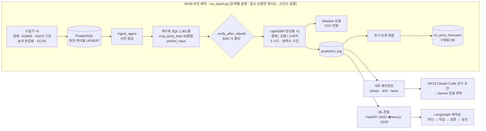
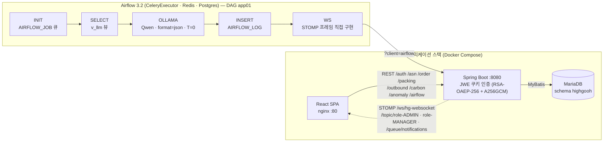
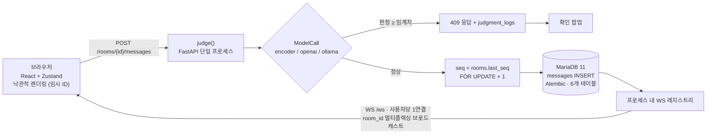
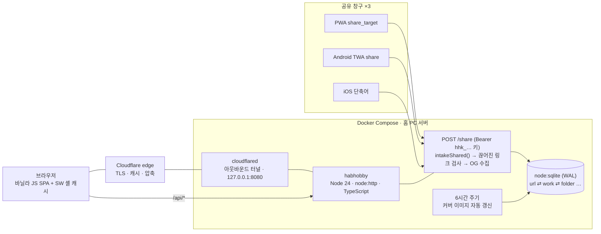
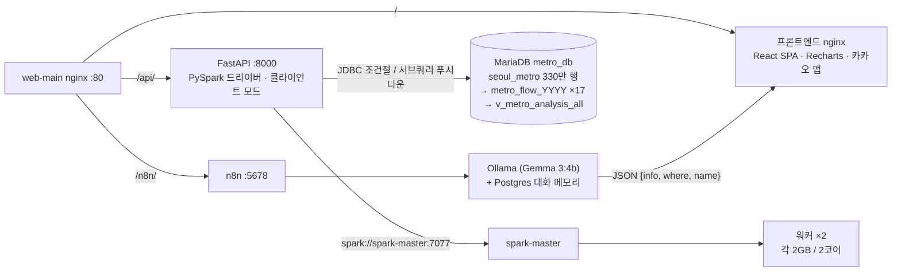

<table>
<tbody>
<tr><td align='right'><b>거주지</b></td><td align='left'>경기도 성남시</td></tr>
<tr><td align='right'><b>이메일</b></td><td align='left'>agii990114@gmail.com</td></tr>
<tr><td align='right'><b>자격증</b></td><td align='left'>SQLD, 정보처리기사(필기), 컴퓨터활용능력 2급, GTQ 1급 등</td></tr>
</tbody>
</table>

<!-- &nbsp;
 -->

## Tech Stack

<table align="center">
<thead><tr><th>분야</th><th>기술 스택</th></tr></thead>
<tbody>
<tr><td>AI Agent / LLM</td><td>    </td></tr>
<tr><td>Data / ML</td><td>   </td></tr>
<tr><td>Backend</td><td>   </td></tr>
<tr><td>Frontend</td><td> </td></tr>
<tr><td>Database</td><td> </td></tr>
<tr><td>Infra / DevOps</td><td>   </td></tr>
<tr><td>Design</td><td> </td></tr>
</tbody>
</table>

## Projects

<!-- 

 -->

1. [햇들농산 - 농산물 저장 유통을 위한 무인 일일 가격 예측 ML 파이프라인](#1-햇들농산---농산물-저장-유통을-위한-무인-일일-가격-예측-ml-파이프라인)
2. [Highgooh — ESG 공급망 데이터 및 탄소 배출 모니터링 ERP](#2-highgooh--esg-공급망-데이터-및-탄소-배출-모니터링-erp)
3. [Career-Jikimi — 사내 채팅 메시지 오발송 방지 AI 가드](#3-career-jikimi--사내-채팅-메시지-오발송-방지-ai-가드)
4. [HabHobby — 북마크 자동 분류저장 및 공유관리 어플](#4-habhobby--셀프-호스팅-링크-라운처--공유-컬렉션)
5. [Apache Spark 기반 서울시 지하철 승하차 데이터 분석](#5-apache-spark-기반-서울시-지하철-승하차-데이터-분석)

### 1. 햇들농산 - 농산물 저장 유통을 위한 무인 일일 가격 예측 ML 파이프라인

<table align="center">
<thead><tr><th>항목</th><th>내용</th></tr></thead>
<tbody>
<tr><td><b>기간</b></td><td>2026-08-18 → 2026-09-21 (배치 운영: 08-25 ~)</td></tr>
<tr><td><b>팀 구성</b></td><td>5인 다중 파트 프로젝트 (마스터 / 구매 / 재무 / 물류 / 영업 / ML)</td></tr>
<tr><td><b>역할</b></td><td>ML 파트 단독 전담 (데이터, 모델, 배치, 에이전트, 콘솔), 프론트엔드</td></tr>
<tr><td><b>리포지토리</b></td><td><a href="https://github.com/nobadai/mainproject">https://github.com/nobadai/mainproject</a></td></tr>
</tbody>
</table>

#### 주제 (Topic)

* 배추, 무, 양파의 유통 단계별 3가지 가격(경매가·도매가·소비자가)을 최대 18영업일 앞까지 예측하고 예측 구간을 산출하는 운영용 ML 서비스입니다. 매일 아침 배치가 5개 공공 데이터를 수집하고, 피처 테이블을 재구축한 뒤 3개의 LightGBM 모델 앙상블을 실행하며, 과거 예측 성과를 측정하고 예측 곡선을 구매팀 DB에 전송합니다.

#### 기획 의도 (Planning Intent)

* 회사는 경매가가 저렴할 때 매수하여 저온 창고에 보관한 뒤, 적절한 가격으로 매도하는 *저장 유통(Storage Trading)*을 수행합니다. 이 스프레드 매매를 지원하기 위해서는 두 가지 다른 관점의 예측이 필요하지만, 농산물 가격은 변동성이 매우 큽니다 (배추 일일 변동성 13.97%, 태풍 힌남노 시기 한 달간 경매가 +68% 급등).

* 따라서 사람이 개입하지 않고도 정직한 불확실성을 담은 일일 예측 곡선을 제공하는 것을 목표로 삼았습니다 (매수/매도 신호 제안은 비즈니스 룰 영역으로 분리). 기획 단계부터 데이터 기반으로 스코프를 설정하여, 가격 변화가 거의 없는 마늘은 제외하고, 소비자가는 서울 지역으로 한정하며, 경매가는 가락시장 특 등급 및 품목별 정규 규격으로 고정했습니다.

#### 아키텍처 (Architecture)

#### 주요 작업 및 성과 (Key Work & Outcomes)

| 항목 | 내용 |
|---|---|
| **데이터 파이프라인** | 5개 UPSERT 수집기(32개 시장 156만 건 경매, KAMIS 도매/소비자 105만 건, 95개 관측소 ASOS 기상, 농넷 반입량, ECOS/KDI 지표)와 공휴일·학사일정·뉴스 피드 연동. 60개 컬럼의 학습 테이블(21만 2천 행, 2,862개 기준일)과 2축 유통/조사 달력을 생성하는 1,801줄의 재구축 SQL 개발. |
| **모델링** | LightGBM L1, 5개 시드 앙상블, 76개 트리 구조. 예측 타겟을 앵커 스케일 기반 `log(타겟 / 앵커)`로 변환하여 리드 타임 미반영 문제(원천 가격 사용 시 중요도 1.5%에 불과)를 해결. 경매가/도매가에 대해 분위수 회귀(Quantile Regression) 기반 예측 구간 산출. |
| **엄격한 검증 체계** | 3개 폴드 교차 검증 적용 (폴드 B는 유일한 수급 충격 연도). **2024~2025년 미공개 홀드아웃(Holdout) 데이터셋 단 1회 평가 원칙** 준수, 9개 베이스라인 중 가장 강력한 것과 비교, 품목별 분리 평가, 2× 시드-σ 규칙 적용. 총 42회 실험 수행 (9개 적용, 20개 기각). |
| **평가 결과 (밀봉 홀드아웃 vs 강력한 베이스라인)** | 소비자가 오차 **+9.0 / +12.9 / +11.8%** 개선 (무 / 배추 / 양파), 배추 경매가 오차 양쪽 구간 모두 **+13.1%** 개선되며 변동성이 큰 시기일수록 우수한 성과를 보임. 실운영 기준: 76,614건 평가 완료, 배추 경매가 오차 21.1% 기록 (단순 예측 30.9% 대비 우수). XGBoost, CatBoost, TFT, LSTM, GRU 등 타 모델 대비 LightGBM이 압도적 성과 기록 (23/24개 셀에서 2σ 이상 격차로 우수). |
| **운영 자동화** | 09:00 배치 실행 (~13분 소요), 일시적 오류 전용 재시도 로직, 사전 트렁케이트 검증, BAD 판정 시 즉시 중단되는 사후 검증, 누락 알림, 그림자 모델 실행 체계 적용. 구매팀 테이블로 27,864건 데이터 정상 전달. |
| **에이전트** | 데이터 수집 / 품질 / 배치 실패 / 데이터 표류 / 예측 설명 / 뉴스 에이전트 구축 (**룰이 판단하고 LLM은 요약만 담당**). 2단계 human-in-the-loop 검증을 거치는 LangGraph 재학습 흐름 구축. Gemini로 번역되는 일일 Claude Code 감사 리포트 자동화 (216개 수치 100% 일치). 28개 엔드포인트의 FastAPI 콘솔 및 Next.js UI 개발. |

#### 기술 스택 (Tech Stack)

| 분류 | 기술 |
|---|---|
| **ML / Data** | Python 3.11/3.12, LightGBM 4.5 (L1 + 분위수 회귀), pandas 2.2, numpy 2.1, scikit-learn, XGBoost, CatBoost, neuralforecast + PyTorch Lightning (격리된 환경 비교용) |
| **Database / Batch** | PostgreSQL, psycopg 3, DBeaver 실행 SQL, Windows Task Scheduler + `.bat` 래퍼, Docker (python:3.12-slim, non-root) |
| **Service / UI** | FastAPI, uvicorn, Next.js 16, React 19, TypeScript 5.9, Tailwind 4, Streamlit |
| **Agents / LLM** | LangGraph + SQLite checkpointer, Anthropic SDK, Claude Code CLI, Gemini flash-lite, Ollama, 민감정보 마스킹 레이어 |
| **External Data** | 공공데이터포털 경매 API, KAMIS, 기상청 ASOS, 농넷, 한국은행 ECOS, 천문연구원, NEIS, 네이버 뉴스 API |

#### 트러블슈팅 (Troubleshooting)

- **경매가 타겟에 15개 포장 규격 혼재** 
  수집기가 서로 다른 규격(1kg 상자 11,224원, 10kg 망 711원)을 단순 평균 내어 815일 중 737일 동안 특 등급이 상 등급보다 저렴하게 집계되는 문제 발생. 품목별 중량 및 포장 규격을 고정하여 배추 ACF(1)를 0.085 → 0.795로 개선하고, 약 12,000회 API 호출을 통해 156만 건의 데이터를 재수집함.

- **점수 산출 코드의 필터 미적용 오류** 
  평가 대상 행의 74%가 다른 규격과 비교되고 있던 현상(실제 521원 데이터를 2,545원 평가)을 발견하여 재집계 수행. 오류 수정 전 산출된 모든 경매가 점수를 무효화하고 타 팀 전달 수치 수정 발표.

- **문자열 `"None"`으로 인한 일자별 데이터 누락** 
  `str(raw.get("pkg_nm", "")).strip() or "미상"` 로직이 `null` 입력 시 정상 작동하지 않아 배치는 성공했으나 데이터가 누락됨. 구매팀 제보로 확인 후 `_text()` 헬퍼 도입, 46,941행 데이터 복구 및 검증 절차 2종 추가.

- **폴드 B 교차검증 불일치 문제** 
  태풍 수급 충격이 있던 2022년 데이터에서 거래량-가격 간 관계가 반전되는 현상 확인. 피처 이상을 의심하기 전 해당 연도의 특이성을 먼저 분석하도록 검증 원칙 수립.

- **운영 환경에서 교차검증 결과가 반전된 문제** 
  교차검증은 4~6년 데이터를 사용하나 실제 운영은 7년 데이터를 학습에 사용하며, 양파는 앵커를 이기려면 5년 이상의 학습 데이터가 필요했음 (배추 실운영 −5.7%로 역전). 구조 변경 시 운영 조건과 동일한 환경에서 재구축하여 라이브 구간을 평가하도록 개선.

### 2. Highgooh — ESG 공급망 데이터 및 탄소 배출 모니터링 ERP

<table align="center">
<thead><tr><th>항목</th><th>내용</th></tr></thead>
<tbody>
<tr><td><b>기간</b></td><td>2026-04 → 2026-06 (6월 집중 개발)</td></tr>
<tr><td><b>팀 구성</b></td><td>4명 (PM 1, 개발자 3)</td></tr>
<tr><td><b>역할</b></td><td>풀스택 (FE 리드 & BE) — Figma UI/UX, React 대시보드, Spring Boot API (주문·포장·송장·출고 이력), AI 리포트 UI, 실시간 알림</td></tr>
<tr><td><b>리포지토리</b></td><td><a href="https://github.com/agii990114-ctrl/dev_highgooh">https://github.com/agii990114-ctrl/dev_highgooh</a></td></tr>
</tbody>
</table>

#### 주제 (Topic)

* 알루미늄 가공 공장을 위한 ERP 스타일 운영 플랫폼입니다. **물류 프로세스**(ASN → 입고 → 주문 → 포장 → 출고 → 송장/운송장 → 출고 이력)와 **공정별 탄소 배출 모니터링**(Scope 1/2 대시보드, 기준 배출 계수 대비 이상 감지, Apache Airflow + 로컬 LLM(Ollama/Qwen) 기반 일일 한국어 "탄소 이상 개선 권고 리포트" 생성 및 관리자 대상 실시간 WebSocket 알림)을 결합했습니다.

#### 기획 의도 (Planning Intent)

* ESG 공시 의무가 확대되고 있음에도 현장의 탄소 배출 데이터는 파편화되어 엑셀로 수작업 관리되며 수식 오류에 취약했습니다. 당초 목적은 탄소 배출량을 자동 집계·시각화하는 ESG 플랫폼이었으나, **개발 중간에 탄소 모니터링이 결합된 물류 ERP로 핵심 범위를 피벗**했습니다.

* ERP 레퍼런스를 분석하고 Figma 화면 흐름을 공유함과 동시에 API 명세를 선제 정의하여 팀원들이 병렬로 개발을 진행했고, 피벗 후 4주 만에 핵심 기능을 완성했습니다. 8개의 이슈 템플릿, PR 기반 기능 브랜치, GitHub Discussions 의사결정 기록 등 스프린트 기반 프로젝트 관리를 수행했습니다.

#### 아키텍처 (Architecture)

#### 주요 작업 및 성과 (Key Work & Outcomes)

**본인 담당 업무**

| 항목 | 내용 |
|---|---|
| **화면 흐름 기획 및 Figma UI/UX 디자인** | 물류 및 탄소 모니터링 모듈의 화면 흐름, React 컴포넌트 아키텍처, Redux Toolkit 슬라이스 및 대시보드 인터페이스 설계. |
| **Spring Boot + MyBatis API 구현** | MariaDB 기반 주문, 포장, 출고/송장, 출고 이력 API 구현 — 송장 번호 자동 채번(`INV-YYYYMMDD-{id}`), 상태 코드 기반 출고 제어, 박스별 포장 완료 시 상위 주문 상태를 자동 승격하는 트랜잭션 처리. |
| **출고 이력 KPI** | 전체 / 정시 / 지연 출고 건수를 집계하는 CTE 쿼리 작성 ("정시 출고" = 예정시간 전 모든 박스 출고 완료). |
| **포장 QR 스캔 루프** | 박스별 QR 코드 생성(오류 정정 레벨 H), 스캔 즉시 포장 상태를 완료로 전환하는 전용 화면 연동. |
| **문서 내보내기** | 5개 주요 화면 엑셀(`.xlsx`) 내보내기 및 AI 리포트 워드(`.docx`) 내보내기 구현. |
| **AI 리포트 화면 및 API** | `AirflowLogMapper` 쿼리 작성, STOMP 역할별 주제 구독 기반의 실시간 알림 종 기능 구현. |

**시스템 성과 (팀 전체)**

| # | 내용 |
|---|---|
| 1 | Swagger로 문서화된 9개 도메인, 약 40개 REST 엔드포인트 구축 (150개 Java 파일, 약 8,000 LOC). |
| 2 | JWE 토큰(RSA-OAEP-256 + A256GCM) 쿠키 인증 및 BCrypt 암호화. |
| 3 | STOMP/WebSocket 기반 1:1 및 역할별 브로드캐스트 시스템. |
| 4 | 7단계 Airflow DAG를 통한 작업 큐 소진, LLM 리포트 생성, DB 트랜잭션 저장, 백엔드 알림 자동화. |
| 5 | 월/분기/연간 탄소 집계 대시보드 및 이상 조치 워크플로우 구축. |

#### 기술 스택 (Tech Stack)

| 분류 | 기술 |
|---|---|
| **Backend** | Java 21, Spring Boot 3.5, Spring Security, Spring WebSocket/STOMP, MyBatis 3.0.5, springdoc-openapi 2.8, Nimbus JOSE+JWT 10.9, Actuator + Micrometer/Prometheus, Maven |
| **Frontend** | React 19.2, Vite 8, react-router 7, Redux Toolkit 2, axios, @stomp/stompjs 7, Chart.js 4 + react-chartjs-2, SheetJS (xlsx), docx + file-saver, qrcode.react, SweetAlert2, ESLint 10 |
| **Data Pipeline / AI** | Apache Airflow 3.2.2 (CeleryExecutor, Redis, PostgreSQL 13), MySqlHook, XCom, Airflow Variables, Ollama (Qwen), websocket-client |
| **Database / Infra / Design** | MariaDB 12, Docker Compose, nginx 1.31, Temurin 21 다단계 빌드, GitHub Actions (자체 러너), GitHub Secrets, Figma |

#### 트러블슈팅 (Troubleshooting)

- **개발 중 ESG 단독에서 물류 ERP로 범위 피벗** 
  기존 FastAPI/Next.js 기획 및 엑셀 업로드 기능이 맞지 않게 됨. Spring Boot + React 기반으로 재설정하고 ERP 레퍼런스를 분석하여 Figma 화면 흐름과 API 명세를 선제 정의함으로써 피벗 후 4주 만에 핵심 물류 기능 개발 완료.

- **Neo4j 그래프 데이터베이스의 공정별 집계 부적합** 
  그래프 모델이 시계열 탄소 배출 집계 연산에 비효율적임을 확인. Neo4j 도입을 철회하고 관계형 테이블 및 `v_llm` 전처리 뷰 기반의 Airflow DAG 구조(수집 → 이상 분석 → LLM 진단 → WebSocket 알림)로 재설계.

- **LLM 응답의 JSON 포맷 이탈로 인한 리포트 생성 실패** 
  여러 모델을 비교하여 Qwen을 선정하고 엄격한 시스템 프롬프트 작성, `format=json` 및 `temperature 0` 설정, `JSONDecodeError` 폴백 핸들러를 추가하여 파싱 실패로 인한 DAG 중단율을 0%로 개선.

- **다른 권한으로 재로그인 시 이전 알림 구독이 유지되는 문제** 
  STOMP 구독이 마운트 시 1회만 생성되던 현상. useEffect 의존성 배열에 `role`을 추가하고 `deactivate()` 클린업 로직을 구현하여 로그인/로그아웃 시 올바른 알림 주제로 재구독하도록 수정.

- **송장 번호 채번 및 경로 충돌** 
  포장 송장 번호가 `int` 타입이던 문제를 `INV-YYYYMMDD-{packingId}` 포맷의 `String`으로 변경하고, 경로 변수에 `[A-Za-z0-9-]+` 정규식을 적용하여 숫자형 경로와의 충돌을 방지함. 루프 내 DTO 재할당으로 인한 가변 상태 문제는 명시적 DAO 파라미터 전달 방식으로 변경하여 해결.

### 3. Career-Jikimi — 사내 채팅 메시지 오발송 방지 AI 가드

<table align="center">
<thead><tr><th>항목</th><th>내용</th></tr></thead>
<tbody>
<tr><td><b>기간</b></td><td>2026-07-29 → 2026-08-04 (6일)</td></tr>
<tr><td><b>팀 구성</b></td><td>2명 (기존 6명에서 축소)</td></tr>
<tr><td><b>역할</b></td><td>AI / 풀스택 — 데이터셋 설계, 미세조정, 평가, 판정 파이프라인, 데모 채팅 앱 개발</td></tr>
<tr><td><b>리포지토리</b></td><td><a href="https://github.com/Bomb-pod/career-jikimi">github.com/Bomb-pod/career-jikimi</a></td></tr>
<tr><td><b>모델/데이터</b></td><td>HF Hub <code>agii0114/career-jikimi-context-guard</code>, <code>agii0114/career-jikimi-context-dataset</code></td></tr>
</tbody>
</table>

#### 주제 (Topic)

* 한국어 사내 업무용 채팅을 위한 **전송 전 메시지 오발송 감지기**입니다. 사용자가 전송 버튼을 누르면, 해당 채팅방의 최근 대화 내역과 입력한 메시지가 미세조정된 한국어 Cross-Encoder 모델로 전달되어 "이 채팅방에 어울리지 않을 확률"을 반환합니다.

* 확률이 임계치를 넘으면 메시지가 저장·전송되기 전 확인 팝업창을 띄웁니다. 데이터 누수가 통제된 데이터셋, 미세조정 분류기, 평가 프로토콜, 교체 가능한 판정 백엔드 등 **판정 능력 그 자체**가 핵심 성과물이며, 실시간 채팅 앱은 기능 시연을 위해 가볍게 구현되었습니다.

#### 기획 의도 (Planning Intent)

* 한 번 읽힌 잘못 보낸 메시지는 회수할 수 없으므로 전송 단계에서 미리 차단하도록 설계했습니다. 개발 직전 팀원이 6명에서 2명으로 줄어듦에 따라, 기존 VLM/이미지 감지 범위를 축소하고 "텍스트 기반의 맥락 중심 오발송 감지"로 문제를 재정의하여 6일 안에 완성할 수 있도록 조정했습니다. 정상적인 메시지에 팝업이 뜨면 서비스 사용성이 크게 저하되므로, 정밀도(Precision) 최우선 정책(오탐 0건)을 최우선 목표로 최적화했습니다.

* 실제 운영 중에는 차단된 메시지만 피드백이 들어오므로 재현율(Recall)은 측정이 불가능한 것으로 명시하고 오발송 신고 버튼을 별도 제공했습니다. 욕설/개인정보 필터링은 범위에서 제외하여 오직 오발송 감지 성능만 정밀 측정하도록 유지했습니다.

#### 아키텍처 (Architecture)

#### 주요 작업 및 성과 (Key Work & Outcomes)

| 항목 | 내용 |
|---|---|
| **데이터셋 엔지니어링 (6일 중 3일 소요)** | TF-IDF 검증 시 대화 맥락 없이 답변만 보고도 99.2% 정확도가 나오는 현상을 확인하고 v1 데이터셋을 폐기(말투 분류기가 되는 문제). 동일 답변이 적절/부적절 맥락에 각각 1회씩 교차 등장하는 **1,000건의 반실제적 쌍(Counterfactual-pair) 데이터셋**으로 재구축(답변만 보고 맞추는 수치 0.40으로 정상화). 16개 가상 대화방 및 200건의 테스트 세트 작성. |
| **화자 익명화** | 학습 데이터의 화자 표기를 서빙 형식과 동일하게 가공(`팀장:` → `A:`)하여 모델의 일반화 성능 향상 (검증 정확도 0.855 → 0.890). |
| **모델 미세조정** | `skt/A.X-Encoder-base` (ModernBERT, 149M) 모델을 이진 Cross-Encoder로 미세조정. 쌍(Pair) 단위 StratifiedGroupKFold 5-fold 교차 검증 적용 및 4 에포크(Epoch) 학습 고정. |
| **평가 결과** | 평가 데이터셋 기준 **AUC 1.000, Precision 1.000, 오탐(False Positive) 0건** 달성, CPU 환경 평균 응답 속도(p50) 512ms 기록. 대화 내역을 타 대화방 내용으로 교체하는 절제 연구(Ablation) 시 AUC가 0.638로 하락하여 맥락 의존성 입증. OOF 정확도 0.854로 규칙 기반 Baseline(0.725) 대비 우수. |
| **판정 백엔드 & 데모 앱** | 3가지 판정 백엔드 연동, CLI 기반 오프라인 평가 도구 제공, FastAPI + MariaDB + React 데모 앱 구축, 8개 ADR 작성, pytest 355개 / Vitest 147개 테스트 통과, CPU 전용 PyTorch 활용 3단계 Docker 빌드 적용. |

#### 기술 스택 (Tech Stack)

| 분류 | 기술 |
|---|---|
| **ML** | PyTorch, transformers, skt/A.X-Encoder-base, scikit-learn (StratifiedGroupKFold, TF-IDF leakage probes), pandas, Hugging Face Hub, Colab T4 / RTX 3050; OpenAI Structured Outputs, Ollama (qwen3.5:4b) |
| **Backend** | Python 3.12, FastAPI 0.115, SQLAlchemy 2.0 (async), Alembic, MariaDB 11, Starlette WebSocket, PyJWT, argon2-cffi, pydantic-settings |
| **Frontend** | React 18, TypeScript 5.7, Zustand 5, Vite 6, Vitest |
| **Infra / QA** | Docker, Docker Compose, nginx, multi-stage Dockerfile, pytest, ruff, pip-audit, AI-DLC 워크플로우 |

#### 트러블슈팅 (Troubleshooting)

- **배포 환경 임계치(Threshold) 0.99 오적용 문제** 
  설정 파일 우선순위에 의해 학습 시 생성된 `threshold.json`의 0.99 값이 적용되어 감지 알림이 거의 뜨지 않던 오류 발견. 환경 변수(env) 값을 최우선 적용하도록 수정하고 서버 시작 시 적용된 설정을 로그로 출력하도록 개선.

- **학습 전 데이터셋 누수(Leakage) 현상** 
  답변만으로 99.2% 정확도가 나와 정답 라벨이 '맥락'이 아닌 '말투'에 매겨져 있음을 발견. 반실제적(Counterfactual) 데이터 쌍 재구축, GroupKFold 교차 검증 적용 및 상시 누수 검증 로직을 프로젝트 규칙으로 정의.

- **특정 이름 사용으로 인한 모델 암기 현상** 
  대화 내역에 특정 한국어 이름이 반복 등장하여 오버피팅 발생. 등장 순서대로 화자를 `A/B/C`로 익명화하여 서빙 형식과 일치시키고 검증 정확도를 0.855에서 0.890으로 개선.

- **절대적 기준으로 인한 학습 게이트 패일 오류** 
  학습 노트북에서 요구하는 "학습 정확도 ≥ 0.90" 기준 때문에 정상 학습 결과(train 0.885 / val 0.890)가 실패로 출력되던 문제를 상대적 검증 기준(`train < max(0.70, val − 0.02)`)으로 교체하여 해결.

- **난이도 높은 평가 데이터셋에서 재현율(Recall) 0.020 기록** 
  오답 50건 분석 결과 92%가 지시 위반이나 단순 사실 관계 모순 때문임을 확인. 모델 한계를 문서화하고 2단계 개선 계획(규칙 기반 사전 검사 + 모순 유형 추가 데이터 학습) 수립.

### 4. HabHobby — 북마크 자동 분류저장 및 공유관리 어플

<table align="center">
<thead><tr><th>항목</th><th>내용</th></tr></thead>
<tbody>
<tr><td><b>기간</b></td><td>2026-09-01 → 2026-09-13 (101 커밋)</td></tr>
<tr><td><b>팀 구성</b></td><td>개인 프로젝트</td></tr>
<tr><td><b>역할</b></td><td>디자인, 풀스택, Android 래퍼, DevOps, 문서화</td></tr>
<tr><td><b>라이브 서비스</b></td><td>kim5ing.cloud (Cloudflare Tunnel, 개인 서버)</td></tr>
</tbody>
</table>

#### 주제 (Topic)

* 모바일이나 브라우저에서 공유된 URL을 사이트·폴더·연재 일정별 정보 카드로 만들어 주고 한 번의 터치로 원본 링크로 연결해 주는 "링크 전용 라운처"입니다. 11개 연재형 콘텐츠 플랫폼(웹툰, 드라마, 애니메이션)은 *작품(시리즈)* 단위로 정규화하여 수집하며, 기타 일반 도메인은 자동 그룹화됩니다.

* 폴더 컬렉션은 친구들과 복제, 미러링, 공동 편집이 가능하며, 3가지 수집 경로(PWA Share Target, Android 공유, iOS 단축어)가 하나의 서버 함수로 통합 처리됩니다. 진척도 기록 서비스가 아니므로 원본 플랫폼을 최우선 출처로 유지합니다.

#### 기획 의도 (Planning Intent)

* 브라우저 북마크는 기기/계정에 귀속되고, 메신저로 공유된 링크는 대화 속에 묻히는 문제를 해결하고자 했습니다. "공유 버튼 = 등록 완료" (계정 연동 없이 오픈 그래프 데이터만 활용), 안정적인 작품 전용 URL 생성을 통한 작품 단위 연동, 진척도 관리는 원본 플랫폼에 위임, 불완전한 메타데이터에 대한 "정보 없음" 대응 화면 구현이라는 4가지 원칙을 세웠습니다.

#### 아키텍처 (Architecture)

#### 주요 작업 및 성과 (Key Work & Outcomes)

| 항목 | 내용 |
|---|---|
| **외부 의존성 제로 (Zero-dependency)** | Node.js 24 타입 스트리핑을 활용하여 빌더/트랜스파일러/npm 패키지 없이 순수 내장 모듈(`node:http`, `node:sqlite` WAL, `node:crypto`)과 TypeScript만으로 구축. 서버 약 5,000 LOC, 바닐라 JS 클라이언트 7,100줄, 12개 스키마 마이그레이션 적용. |
| **중복 제거 수집 파이프라인** | `intakeShared()` 함수가 깨진 링크(`ENOTFOUND`, 404, 410)를 차단하고 메타데이터를 수집함. 5명의 사용자가 동일한 작품을 저장해도 메타데이터 수집은 1회만 수행되어, 기존 URL 저장 속도가 64ms에서 5ms로 대폭 개선됨. |
| **공유 모델** | 초대 링크 기반 친구 관계 구축, 폴더 생성 시 유형 고정(*일반* = 공개 규칙이 적용된 복제/미러링, *공유* = 공동 편집)으로 의도치 않은 공개 방지, 미러링 항목에 대한 개인별 덮어쓰기 지원. |
| **보안 기틀** | scrypt + 계정별 솔트 + `timingSafeEqual`, 해시 기반 세션 및 공유 키 저장, 로그인 시도 제한, CSP 설정, non-root 컨테이너 및 `127.0.0.1` 루프백 바인딩 적용. |
| **모바일 연동** | PWA `share_target`, 수작업 작성된 Android TWA (Digital Asset Links 적용), iOS 단축어 수집 지원. |
| **성능 최적화** | 부하 테스트 시 60명의 혼합 사용자 기준 `/api/state` **1,594 req/s** 처리, 1,000개 동시 접속 상태에서 오류율 0% 및 RSS 235MB 기록. 캐싱 적용으로 처리량 +27% 향상, 61개 쿼리가 실행되던 경로를 1개 쿼리로 단축 (5.27ms → 0.50ms). |
| **운영 안정성** | Docker Compose + Cloudflare Tunnel 라우팅 버전 관리, 22개 백업 데이터베이스 복구 테스트 완료(21개 부팅 성공), 43건의 트러블슈팅 내역 문서화. |

#### 기술 스택 (Tech Stack)

| 분류 | 기술 |
|---|---|
| **Server** | TypeScript on Node.js 24 (빌드 과정 없음), `node:http`, `node:sqlite` (SQLite WAL), `node:crypto` |
| **Client** | vanilla JavaScript ES 모듈, CSS, Web App Manifest (`share_target`), Service Worker 셸 캐시 |
| **Mobile** | Android Trusted Web Activity (androidbrowserhelper 2.5.0), Java 17, iOS Shortcuts |
| **Infra** | Docker Compose, Cloudflare Tunnel (`cloudflared`), Cloudflare edge, Git |

#### 트러블슈팅 (Troubleshooting)

- **v7 이전 백업 데이터베이스 복구 실패 오류** 
  `work` 테이블을 분할하는 마이그레이션 로직이 소스 순서상 `once(12)` 뒤에 위치하여 스키마 버전만 승격되고 마이그레이션이 스킵되는 버그로 인해 16개 중 7개 백업에서 부팅 에러 발생. 코드 순서를 재조정하고 마이그레이션 실패 시 예외를 던지도록 수정하여 21/22개 백업 정상 복구 완료.

- **테스트 서버의 운영 데이터베이스 잠금 현상 (~2분 장애)** 
  부하 테스트 인스턴스가 실운영 SQLite 파일에 접근하여 WAL 잠금 발생. `DATA_DIR` 환경 변수를 분리하고 `VACUUM INTO` 스냅샷 기반으로 테스트가 실행되도록 수정함.

- **초대 코드의 보안 취약점** 
  초대 코드 10자리 중 8자리가 `Date.now()` 수치로 생성되던 무제한 엔드포인트 문제 발견. 72비트 난수 생성 로직으로 교체하여 보안 강화.

- **재배포 시 라이브 터널 단락 현상 (HTTP 530)** 
  다른 PC에서 터널을 재생성하면서 기존 토큰이 만료되었으나 이전 컨테이너가 연결을 유지하고 있어 문제를 감추고 있었음. 터널 토큰을 재발급하고, 살아 있는 연결이 만료된 인증 정보를 감출 수 있다는 점을 문서화.

- **배포 후 이전 UI가 캐싱되는 문제** 
  Cloudflare 무료 플랜 기본 설정이 `no-cache` 헤더를 무시하고 4시간 TTL을 적용하던 문제. 부팅 시 산출되는 해시 기반 자원 URL과 `ETag`/304 응답 구조로 전환하여 즉시 반영되도록 해결.

### 5. Apache Spark 기반 서울시 지하철 승하차 데이터 분석

<table align="center">
<thead><tr><th>항목</th><th>내용</th></tr></thead>
<tbody>
<tr><td><b>기간</b></td><td>2026-03-18 → 2026-03-27 (8영업일)</td></tr>
<tr><td><b>팀 구성</b></td><td>개발자 3명</td></tr>
<tr><td><b>역할</b></td><td>개발자 & 리포지토리 통합 담당 — 주말/야간 핫스팟 분석 + AI 추천 트랙, Spark/Docker 네트워크 구축, 포트폴리오 메인 허브 구축 (60개 PR 중 33개 병합)</td></tr>
<tr><td><b>리포지토리</b></td><td><a href="https://github.com/agii990114-ctrl/subway_spark_project">GitHub <code>HighGooh</code></a></td></tr>
</tbody>
</table>

#### 주제 (Topic)

17년간(2008~2024년, 약 330만 행)의 서울 지하철 시간대별 승하차 빅데이터를 분석하는 풀스택 포트폴리오입니다. React SPA 대시보드와 FastAPI 백엔드가 연결되어, MariaDB 데이터를 Apache Spark SQL로 연산한 후 Recharts 시각화용 JSON으로 반환합니다.

본인 담당 트랙인 **Project 01**은 금~일요일 20:00~23:00 평균 승하차 인원이 가장 높은 역을 도출하고, n8n + Ollama AI 에이전트가 인근 맛집을 추천하여 카카오 맵 상에 핀으로 시각화하며, 환승 경로별 시간대별 혼잡도를 비교하는 기능을 제공합니다. (타 트랙: 출퇴근 비율 기반 역 특성 분류, 어린이날 혼잡도 추이 분석).

#### 기획 의도 (Planning Intent)

330만 건의 데이터에 대해 SQL 직접 집계(`SUM`/`GROUP BY`/`CASE WHEN`)를 실행 시 단일 테스트가 매우 느리고 공용 DB 서버에 과부하가 발생했습니다. 이를 해결하기 위해 DB와 API 사이에 Apache Spark를 분산 인메모리 레이어로 도입하고, 단순 필터 조건을 DB로 푸시다운하며, 연도별 전처리 테이블과 통합 뷰를 구축하여 빠르게 시각화하는 것을 목표로 삼았습니다.

Project 01은 AI 에이전트 및 워크플로우 자동화 경험을 겸하도록 기획되었습니다.

#### 아키텍처 (Architecture)

#### 주요 작업 및 성과 (Key Work & Outcomes)

| 항목 | 내용 |
|---|---|
| **담당 트랙 백엔드 개발 (`main_jh.py`)** | `/drunk_info` (주말/금요일 20~23시 평균 승하차 상위 10개 역 반환), `/get_station` (역 목록 조회), `POST /search_complex` (환승 경로 혼잡도와 전체 평균 비교, 24시 예외 처리 포함). **JDBC 읽기 시 1년 단위 날짜 서브쿼리 푸시다운**을 적용하여 기존 파티셔닝 방식 대비 조회 속도를 획기적으로 개선. |
| **Docker 환경 내 Spark 클라이언트 모드 구축** | 드라이버/블록매니저 포트 고정(10000~10002), `bindAddress 0.0.0.0`, 드라이버 메모리 4G 할당, RPC/네트워크 타임아웃 및 셔플 재시도 설정. MariaDB JDBC 3.5.7 연동 및 UTF-8, `ANSI_QUOTES` 설정을 적용하여 한글 컬럼명 파싱 처리. |
| **AI 에이전트 연동** | Ollama Gemma 3:4b 및 Postgres 대화 메모리가 연결된 n8n 웹훅 2종 구현. 프론트엔드가 `{info, where, name}` 구조의 JSON을 파싱하여 ReactMarkdown 및 카카오 맵 마커로 렌더링하도록 구축. |
| **프론트엔드 개발** | `Jh_data.jsx` (858줄, 서브 컴포넌트 5개) — 연도 선택기, 핫스팟 바 차트, AI 대화 UI, 지도, 경로 검색 및 시간대별 혼잡도 차트 구현. 포트폴리오 메인 허브(`Home.jsx`) 및 환경 변수 기반 axios 인스턴스 구축. |
| **통합 관리 역할** | 팀원 브랜치를 포함한 60개 PR 중 33개 병합 전담, 하드코딩된 설정값을 pydantic-settings 기반 `.env` 구조로 전환. |
| **시스템 성과 (팀 전체)** | 9개 Docker 서비스 구축, 9개 API 엔드포인트 및 17개 연도별 테이블/통합 뷰 구축, 기존 DB 직접 조회 방식 대비 **데이터 처리 시간 약 75% 단축** 달성. WBS 모든 항목 완료. |

#### 기술 스택 (Tech Stack)

| 분류 | 기술 |
|---|---|
| **Backend / Data** | Python 3.10, FastAPI 0.135, PySpark 4.1.1 (Spark Standalone, Spark SQL, JDBC 서브쿼리 푸시다운), pandas, SQLAlchemy 2, pydantic-settings, Java 21, MariaDB JDBC 3.5.7 |
| **Frontend** | React 19.2, Vite 7, react-router 7, Recharts 3, axios, Bootstrap 5.3, react-kakao-maps-sdk, react-markdown |
| **AI / Automation** | n8n 2.7.3 웹훅, Ollama (Gemma 3:4b), PostgreSQL 18 대화 메모리, JSON 출력 제어 프롬프팅 |
| **Infra** | Docker Compose (9개 서비스), nginx 1.28, `apache/spark:4.1.1-java21-python3`, MariaDB 12.1.2, DDNS, Git/GitHub PR 워크플로우 |

#### 트러블슈팅 (Troubleshooting)

- **원천 데이터 직접 조회로 인한 DB 과부하** 
  집계 레이어가 없어 공용 DB 서버가 마비되던 현상. Spark 분산 처리 레이어를 도입하고 연도별 전처리 집계 테이블 및 논리 뷰를 구축하여 데이터 처리 시간을 약 75% 단축시킴.

- **LLM 응답 포맷 이탈로 인한 n8n 워크플로우 단락** 
  모델 응답 형식이 일정하지 않던 문제. JSON 스키마를 강제하는 시스템 프롬프트 작성, `temperature 0` 설정, 프론트엔드의 방어적 백틱 마크다운 제거 및 `try/catch` 예외 처리 로직 적용.

- **Docker 내부 Spark 드라이버-워커 간 통신 장애** 
  클라이언트 모드 콜백이 브릿지 네트워크 상에서 차단되던 문제. `spark.driver.host`, 바인딩 주소, 통신 포트를 명시적으로 고정하고 네트워크 타임아웃 및 셔플 재시도 횟수를 늘려 해결.

- **한글 컬럼명 파싱 및 인코딩 오류** 
  EUC-KR 원천 파일 인코딩 이슈. 파일 수집 시 인코딩을 지정하고, JDBC 속성에 UTF-8 및 `sql_mode='ANSI_QUOTES'`를 적용하여 Spark SQL 상에서 한글 컬럼명이 정상 인식되도록 함.

- **느린 쿼리 실행 중 반복 클릭으로 인한 레이스 조건** 
  사용자 중복 제출 문제. 조회 중인 상태(`isLoading`)에 따라 버튼을 비활성화(`disabled`)하고, `ResponsiveContainer` 키를 재설정하여 차트가 깨끗하게 리렌더링되도록 수정함. 동적 SQL 파싱 전 연도 화이트리스트 검증 로직 추가.

